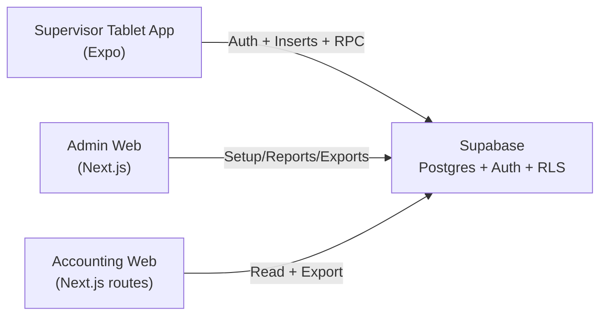
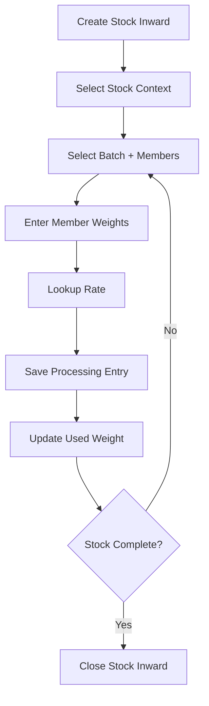

# Padmavathi Freshly Farms
## Prawn Shed Data Entry System

Digital replacement for manual book + Excel operations in prawn shed workflows.

This repository currently contains:
- `padmavathi-admin` (Next.js web app) for Admin/Owner/Accountant
- `tablet-app` (Expo React Native app) for Supervisor shed operations

---

## 1. Product Goal
Build a reliable operations system that:
- captures stock inward + processing data digitally
- computes rate-based payouts with historical safety (snapshot rates)
- supports dynamic setup (types/ranges/batches/rates) without code edits
- gives accounting-friendly exports and reports
- supports tablet-first shed flow and future offline sync

---

## 2. Current Architecture



### Database assumptions used by current code
- master tables: `companies`, `sheds`, `processing_types`, `count_ranges`, `batches`, `batch_members`, `worker_rates`
- transaction tables: `stock_inward`, `processing_entries`
- reporting view: `v_daily_summary`
- RPC: `get_worker_rate(...)`

---

## 3. What Is Completed (As Of Now)

### 3.1 Web Admin (`/src/app`)
- role-based routing/guards:
  - `admin`, `owner` -> `/admin/*`
  - `accountant` -> `/accounting/*`
  - `supervisor` -> `/supervisor-info` (blocked from admin web)
- setup modules:
  - companies, sheds, processing types, count ranges, batches & members
- batch QR generation/download (QR value = `batch_code`)
- worker rate management with server-side overlap handling
- operations views (read/filter/export):
  - stock inward
  - processing entries
- reports:
  - daily summary (`v_daily_summary`)
  - payroll summary (batch-level)
- exports:
  - stock inward CSV
  - processing CSV
  - payroll CSV
  - summary CSV

### 3.2 Tablet App (`/tablet-app`)
- Supabase login
- stock inward create flow
- processing entry with:
  - batch select (QR optional)
  - batch-member-wise weights
  - automatic total weight + amount preview
  - rate lookup via `get_worker_rate` fallback logic
- one-screen linear workflow:
  - create/select stock inward
  - process against selected stock
  - close selected stock inward
- guardrail:
  - processing cannot exceed selected stock balance

---

## 4. Current Workflow (Implemented)



---

## 5. Repository Structure

```text
padmavathi-admin/
  docs/                 # architecture + contracts + sprint checklist
  src/                  # Next.js admin/accounting app
  public/
  tablet-app/           # Expo tablet app
    src/
      screens/
      components/
      lib/
```

### Documentation Index
- [ER Diagram](/Users/sumanthvarma/Desktop/padmavathi-admin/docs/ER_DIAGRAM.md)
- [API / RPC Contracts](/Users/sumanthvarma/Desktop/padmavathi-admin/docs/API_RPC_CONTRACTS.md)
- [Sprint Checklist](/Users/sumanthvarma/Desktop/padmavathi-admin/docs/SPRINT_CHECKLIST.md)
- [Pilot Readiness Checklist](/Users/sumanthvarma/Desktop/padmavathi-admin/docs/PILOT_READINESS_CHECKLIST.md)
- [Maintenance Strategy](/Users/sumanthvarma/Desktop/padmavathi-admin/docs/MAINTENANCE_STRATEGY.md)

---

## 6. Local Setup

## 6.1 Web App (Next.js)
```bash
cd /Users/sumanthvarma/Desktop/padmavathi-admin
npm install
npm run dev
```
Open: [http://localhost:3000](http://localhost:3000)

Required env (`.env.local`):
- `NEXT_PUBLIC_SUPABASE_URL`
- `NEXT_PUBLIC_SUPABASE_ANON_KEY`

## 6.2 Tablet App (Expo)
```bash
cd /Users/sumanthvarma/Desktop/padmavathi-admin/tablet-app
cp .env.example .env
npm install --legacy-peer-deps
npm run web
```

Required env (`tablet-app/.env`):
- `EXPO_PUBLIC_SUPABASE_URL`
- `EXPO_PUBLIC_SUPABASE_ANON_KEY`

Notes:
- web simulation is sufficient for workflow validation when Android Studio is unavailable
- QR camera behavior can vary on web; batch dropdown is supported as primary fallback

---

## 7. Access Model

| Role | Web Access | Tablet Access |
|---|---|---|
| Admin | Full `/admin/*` + accounting | Optional |
| Owner | Full `/admin/*` + accounting | Optional |
| Accountant | `/accounting/reports`, `/accounting/exports` (read/export) | No |
| Supervisor | Blocked on web (`/supervisor-info`) | Primary user |

---

## 8. Engineering Decisions Already Applied
- no hard deletes for setup masters; use `is_active`
- worker rates are effective-dated and overlap-safe in server action
- processing entries store rate snapshots (`rate_per_kg_snapshot`, `amount_snapshot`)
- dynamic dropdowns on tablet use active master data

---

## 9. Gaps / Known Limitations
- tablet stock-context state is session-level UI state (not yet persisted as explicit “open lot” entity in DB)
- member-wise processing persistence is best-effort (depends on presence of `processing_entry_members` table)
- correction/void audit trail not yet implemented
- middleware currently uses deprecated `middleware` convention warning in Next 16 (needs `proxy` migration)
- offline queue/sync not implemented yet

---

## 10. Recommended Next Improvements (Priority Order)

### Phase A - Data Model Hardening
1. add explicit `processing_lots` (or equivalent) table to persist stock lifecycle (`open/closed`, remaining, owner)
2. add `processing_entry_members` table + RLS + indexes, and make member-weight writes mandatory (not best-effort)
3. add DB constraints preventing processed totals beyond stock lot balance

### Phase B - Supervisor Workflow Robustness
1. convert rate lookup + save into one RPC/transaction for atomicity
2. add “today summary” on tablet (raw, processed, balance per open stock)
3. add quick re-entry UX for repeated rounds (reuse previous selections)

### Phase C - Corrections & Audit
1. add void/edit flow for Admin/Owner with reason capture
2. add immutable audit log table for transaction changes
3. add same-day correction window rules

### Phase D - Offline (Milestone 3)
1. local queue storage on tablet
2. sync retries with status indicators
3. conflict strategy (append-only + admin reconcile)

### Phase E - Reporting/Finance Expansion
1. payroll by member (from persisted member weights)
2. company invoicing (company rates + invoice generation)
3. scheduled export packs for accountant

---

## 11. Deployment Direction
- Web: Vercel (`padmavathi-admin` root)
- Tablet: Expo build/EAS or Expo Go for internal pilot
- Supabase: managed Postgres/Auth/RLS/RPC

---

## 12. Quick Validation Checklist

### Functional
- [ ] Admin can maintain setup masters without SQL edits
- [ ] Supervisor can create stock inward and process against selected stock
- [ ] Member-wise weights sum to processing total
- [ ] Processing save blocks when exceeding stock balance

### Security
- [ ] Supervisor cannot access `/admin/*`
- [ ] Accountant cannot mutate setup/rates
- [ ] Admin/Owner retain full control

### Reporting
- [ ] Daily summary numbers align with transactions
- [ ] CSV exports open correctly in spreadsheet tools

---

## 13. Start Test Run (Broad Sequence)
1. Complete [Pilot Readiness Checklist](/Users/sumanthvarma/Desktop/padmavathi-admin/docs/PILOT_READINESS_CHECKLIST.md) sections 1-5.
2. Freeze pilot master data (rates/batches/members) for test window.
3. Run one controlled shed dry-run and capture issues using incident template.
4. Review reconciliation (raw vs processed vs payroll) with accountant.
5. Decide Go/No-Go using sign-off block in pilot checklist.
