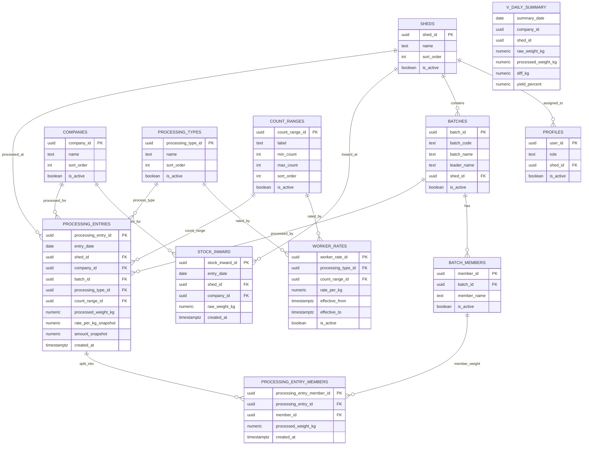

# ER Diagram

This is the working entity model used by the current web + tablet implementation.

## Notes
- `PROCESSING_ENTRY_MEMBERS` is shown as target model for mandatory member-wise persistence.
- `V_DAILY_SUMMARY` is a reporting view derived from transaction tables.
- Rate snapshots in `PROCESSING_ENTRIES` protect historical payroll from future rate changes.
